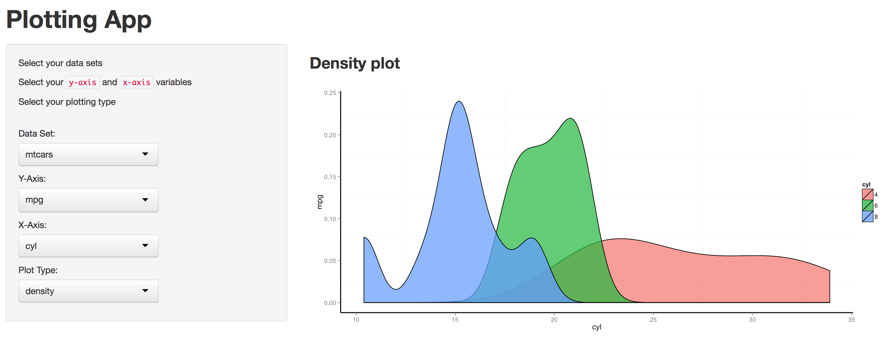
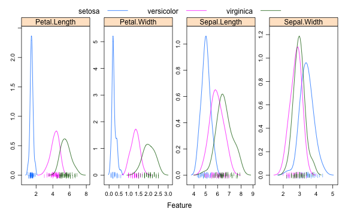

## The Problem
### Implementing Plots in R can take time

```r
# Boxplot of MPG by Car Cylinders
boxplot(mpg ~ cyl, data = mtcars, main = "Car Milage Data", xlab = "Number of Cylinders", 
    ylab = "Miles Per Gallon")
```

 


--- .class #id 

## The Solution: Plotting App to easily plot your data



--- .class #id 

## Next Steps: Overlay Plots of Your Choice


# Example: Avoid implementing overlayed density plots

```r
featurePlot(x = iris[, 1:4], y = iris$Species, plot = "density", scales = list(x = list(relation = "free"), 
    y = list(relation = "free")), adjust = 1.5, pch = "|", layout = c(4, 1), 
    auto.key = list(columns = 3))
```

 


--- .class #id 

## Thank You

If you want to participate, join me at
* GitHub: https://github.com/mtolent23/Data-Products.git
* Email: mtolent23@yahoo.co.uk

